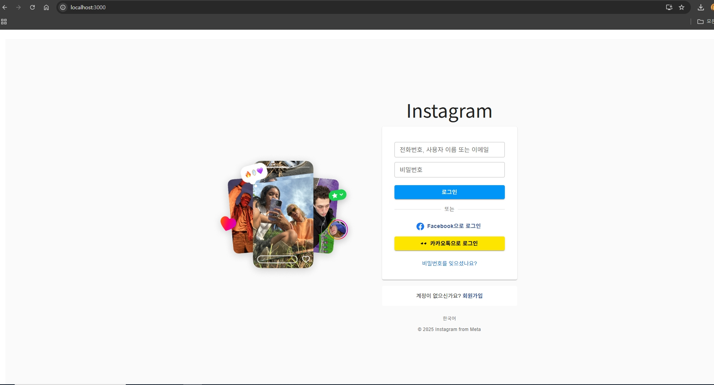
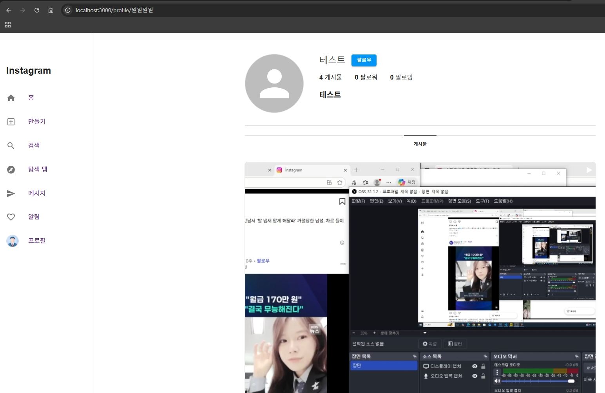
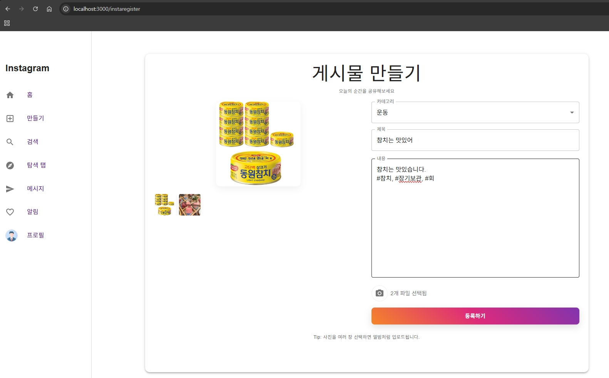
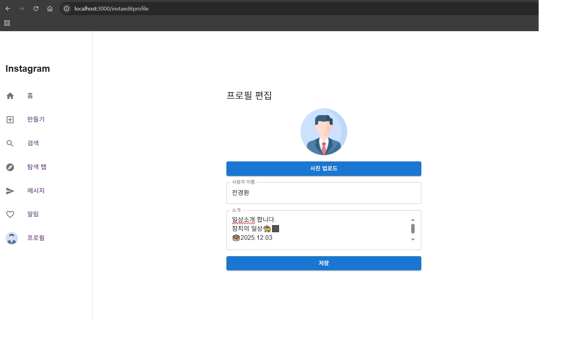

# 💬 Instagram SNS

<!--<p align="center">-->

  <!---->

<!--</p>-->



> 우리의 일상을 기록하고 공유.

Instagram 스타일의 SNS로 공유를 시작해보세요."

## 💡 프로젝트 소개

- Instagram을 모티브로 한 소셜 네트워크 서비스(SNS) 웹 애플리케이션입니다.
- 학원 동기생들도 게시물을 업로드하고, 좋아요와 댓글을 통해 소통하며, 다른 사용자들의 피드를 탐색할 수 있는 플랫폼이 목적입니다.
- 단순히 텍스트와 이미지를 공유하는 것을 넘어, 동영상 콘텐츠까지 지원하여 더 풍부한 스토리를 공유할 수 있습니다.

---

## 📅 개발기간

#### 2025.11.25 ~ 2025.12.03 (기획 및 제작)

---

## 📌 기획 배경

기존 SNS 플랫폼들은 복잡한 인터페이스와 과도한 기능으로 인해 사용자들이 콘텐츠에 집중하기 어려웠습니다.

Instagram의 직관적이고 깔끔한 UI/UX를 참고하여, 사용자가 게시물에 집중하고 자연스럽게 소통할 수 있는 SNS 플랫폼을 기획하게 되었습니다.

또한, 카카오 소셜 로그인을 통한 간편한 인증과 실시간 메시지 기능을 통해 사용자 간의 소통을 더욱 원활하게 만들고자 했습니다.

---

## 🛠 사용기술

| 구분 | 기술 / 라이브러리 | 
|------|----------------|
| **프론트엔드** |      | 
| **백엔드** |   |
| **데이터베이스** |  |
| **기타 / 도구** |    |

---

## ✨ 페이지별 주요 기능

### 1. 로그인 / 회원가입

| 로그인 | 회원가입 |
|---------|---------|
|  |  |

- 일반 로그인 (아이디/비밀번호)
- 카카오 소셜 로그인
- 비밀번호 찾기/재설정
- 비밀번호는 bcrypt로 암호화되어 저장

### 2. 홈 피드 / 게시물 상세보기

| 홈 피드 | 게시물 상세보기 |
|---------|---------|
|  |  |

- 좌측 사이드바 (홈, 검색, 탐색, 메시지, 프로필)
- 우측 추천 사용자 목록
- 좋아요, 댓글 기능
- 이미지/동영상 게시물 업로드 및 조회
- 프로필 이미지 클릭 시 해당 유저 프로필 페이지로 이동

### 3. 탐색 페이지


- 모든 게시물을 그리드 형태로 탐색
- 게시물 클릭 시 상세보기 모달 표시
- 이미지/동영상 미리보기

### 4. 검색 페이지


- 사용자 검색 기능
- 소개글(intro) 또는 사용자명으로 검색
- 검색 결과에서 프로필 이미지 클릭 시 해당 유저 프로필 페이지로 이동

### 5. 프로필 페이지

| 내 프로필 | 다른 유저 프로필 |
|---------|---------|
|  |  |

- 프로필 정보 표시 (게시물 수, 팔로워, 팔로잉)
- 게시물 그리드 뷰
- 프로필 편집 기능 (본인 프로필일 경우)
- 프로필 사진 업로드/삭제
- 다른 유저 프로필일 경우 팔로우 버튼 표시

### 6. 게시물 작성 / 프로필 편집

| 게시물 작성 | 프로필 편집 |
|---------|---------|
|  |  |

- 이미지/동영상 업로드
- 게시물 내용 작성
- 여러 이미지 업로드 지원
- 프로필 정보 수정 (이름, 소개글 등)

### 7. 메시지 (DM)


- 실시간 메시지 기능
- 채팅방 목록 조회
- 메시지 전송 및 수신

---

## 📁 프로젝트 구조

```
react-sns-jgh251125/
├── client/                 # React 프론트엔드
│   ├── src/
│   │   ├── components/     # React 컴포넌트
│   │   │   ├── InstaLogin.js
│   │   │   ├── InstaJoin.js
│   │   │   ├── InstaHome.js
│   │   │   ├── InstaProfile.js
│   │   │   ├── InstaSearch.js
│   │   │   ├── InstaExplore.js
│   │   │   ├── InstaDirect.js
│   │   │   └── ...
│   │   ├── App.js
│   │   └── index.js
│   └── package.json
│
├── server/                 # Express 백엔드
│   ├── routes/            # API 라우트
│   │   ├── insta_user.js
│   │   ├── insta_home.js
│   │   ├── insta_feed.js
│   │   ├── insta_comment.js
│   │   └── insta_message.js
│   ├── server.js
│   ├── auth.js            # JWT 인증 미들웨어
│   ├── db.js              # 데이터베이스 연결
│   └── uploads/           # 업로드된 파일 저장소
│
└── README.md
```

---

## 🚀 시작하기

### 필수 요구사항
- Node.js (v22 이상)
- MySQL
- npm

### 설치 및 실행

1. **저장소 클론**
```bash
git clone <repository-url>
cd react-sns-jgh251125
```

2. **백엔드 설정**
```bash
cd server
npm install
```

3. **데이터베이스 설정**
- MySQL 데이터베이스 생성
- `초기생성테이블.sql` 파일 실행하여 테이블 생성
- `.env` 파일 생성 및 데이터베이스 연결 정보 설정

4. **백엔드 서버 실행**
```bash
cd server
node server.js
# 또는
nodemon server.js
```
서버는 `http://localhost:3010`에서 실행됩니다.

5. **프론트엔드 설정**
```bash
cd client
npm install
```

6. **프론트엔드 실행**
```bash
cd client
npm start
```
프론트엔드는 `http://localhost:3000`에서 실행됩니다.

### 환경 변수 설정(정석)

`server/.env` 파일을 생성하고 다음 내용을 추가하세요:

```env
DB_HOST=localhost
DB_USER=your_username
DB_PASSWORD=your_password
DB_NAME=your_database_name
JWT_SECRET=your_jwt_secret_key
KAKAO_REST_API_KEY=your_kakao_rest_api_key
```

---

## 📡 API 엔드포인트

### 인증
- `POST /instauser/login` - 로그인
- `POST /instauser/join` - 회원가입
- `POST /instauser/kakao/login` - 카카오 로그인
- `POST /instauser/findpassword` - 비밀번호 찾기
- `POST /instauser/resetpassword` - 비밀번호 재설정

### 사용자
- `GET /instauser/user/:userId` - 사용자 정보 조회
- `POST /instauser/profile/upload` - 프로필 사진 업로드
- `DELETE /instauser/profile/image` - 프로필 사진 삭제
- `GET /instauser/search?q=검색어` - 사용자 검색

### 피드
- `GET /instahome` - 전체 피드 조회
- `GET /instahome/:userId` - 특정 사용자 피드 조회
- `GET /instahome/:feedId/images` - 피드 이미지 목록
- `DELETE /instahome/:feedId` - 피드 삭제

### 댓글
- `GET /instacomment/:feedId` - 댓글 목록 조회
- `POST /instacomment/` - 댓글 작성

### 좋아요
- `POST /instafeed/instaheart` - 좋아요 토글

### 메시지
- `GET /instamessage/rooms` - 메시지 방 목록
- `GET /instamessage/room/:roomId` - 메시지 조회
- `POST /instamessage/send` - 메시지 전송

---

## 🔐 인증

이 프로젝트는 JWT(JSON Web Token)를 사용한 인증 방식을 채택하고 있습니다. 대부분의 API 엔드포인트는 `Authorization: Bearer <token>` 헤더가 필요합니다.

---

## 💬 프로젝트 후기

### 😄 좋았던 점

- Instagram의 직관적인 UI/UX를 참고하여 사용자 친화적인 인터페이스를 구현할 수 있었습니다.
- React와 Material-UI를 활용하여 컴포넌트를 구성하고 상태를 관리하면서 프론트엔드 개발 실력을 향상시킬 수 있었습니다.
- JWT를 활용한 인증 시스템과 RESTful API 설계를 통해 백엔드 개발을 했습니다.
- 카카오 소셜 로그인을 구현하면서 외부 API 연동 경험을 쌓을 수 있었습니다.
- 이미지/동영상 업로드, 댓글, 좋아요 등 실제 SNS의 핵심 기능들을 구현하며 전체적인 웹 애플리케이션 개발 프로세스를 경험할 수 있었습니다.
- 사용자 검색, 프로필 탐색, 실시간 메시지 등 다양한 소셜 기능을 구현하며 사용자 경험을 고려한 개발을 할 수 있었습니다.

### 😥 보완할 점

- 실시간 알림 기능을 추가하여 댓글, 좋아요, 메시지 등에 대한 즉각적인 피드백을 제공하고 싶습니다.
- 무한 스크롤 기능을 구현하여 사용자 경험을 더욱 개선하고 싶습니다.
- 이미지 최적화 및 CDN 연동등을 통해 로딩 속도를 개선하고 싶습니다.
- 팔로우/언팔로우 기능을 구현하여 사용자 간의 관계를 더욱 명확하게 표현하고 싶습니다.
- 고아첨부파일을 수시로 삭제하고 싶습니다.
- 게시물 수정 기능을 추가하여 사용자가 게시물을 업데이트할 수 있도록 하고 싶습니다.


---


**참고**: 이 프로젝트는 Instagram의 디자인을 참고하여 개발되었으며, 교육 및 포트폴리오 목적으로 제작되었습니다.
